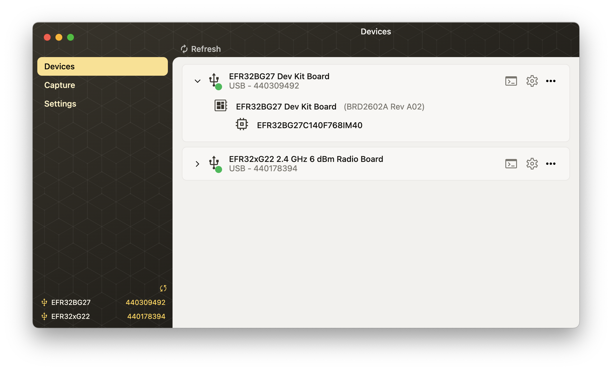

# Simplicity Device Manager - SDM

Simplicity Device Manager is the new hardware management tool of Silicon Labs, which can

- configure and flash devices,
- trace radio packets,
- support other Silicon Labs Software Tools with device access.

## Prerequisites

- Install [SEGGER J-Link](https://www.segger.com/downloads/jlink) if you don't have it yet

## Setup

1. [Download](https://github.com/SiliconLabsSoftware/simplicity-device-manager/releases) and extract Simplicity Device Manager
2. Launch Simplicity Device Manager and check for its system tray icon

#### macOS:

- Executable name: `Simplicity Device Manager.app`
- Suggested location: `Applications` folder

#### Windows:

- Executable name: `sdm-gui.exe`
- Suggested location: `C:\SiliconLabs\simplicity-device-manager`

#### Linux:

- Executable name: `sdm-gui`
- Suggested location: `~/SiliconLabs/simplicity-device-manager`

## Previous Versions

For older versions, check the [Releases](https://github.com/SiliconLabsSoftware/simplicity-device-manager/releases) page.

## Documentation

If you are experiencing any unusual behavior, check [Troubleshoot](docs/troubleshoot.md).

## License

The default license is the [Master Software License Agreement (MSLA)](https://www.silabs.com/about-us/legal/master-software-license-agreement), which applies unless otherwise noted.
